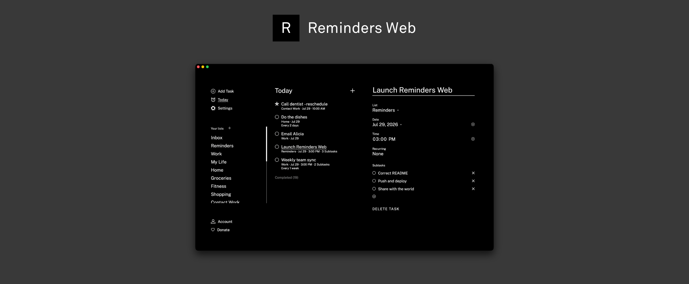

# Reminders Web

A browser companion for the [Reminders tool](https://github.com/zacksimpson/reminders-tool) for the Light Phone III. Laid out as a responsive desktop web app with feature parity and optional phone sync support.



> [!WARNING]
> This web app is still under development, but it's ready to check out. Feel free to contribute by opening an issue or submitting a PR!

To get started, create an account here: https://reminders-tool.web.app

## Features
* Lists, tasks, and subtasks with due dates and recurring tasks
* Full feature parity with Reminders for LPIII
* Automatic account-based syncing
* Browser-based notifications for tasks
* Keyboard shortcuts for fast navigation
* Manually import a backup from the phone tool

(Pro tip: you can add this website to your dock and it works great as a standalone "desktop app", complete with notifications, an icon, and everything!)

## Connecting your phone

Phone syncing requires the [prerelease version](https://github.com/zacksimpson/reminders-tool/releases/tag/v2.0.0-beta.2) of Reminders for the LPIII. It will not work on the build marked "Latest Release".

The LPIII tool and this website share the same account and the same lists/tasks. On your Light Phone III, open Reminders, go to Settings → Account, and sign in with the same email and password you use here. See the in-app "Phone Sync" screen (Account tab) for details on how syncing behaves.

_Note: the prerelease version of the LPIII tool is not yet at full feature parity with the React Native-based build, because it is built using the official Light SDK, which is still maturing. Read more in the release notes!_


## Stack

- React + TypeScript + Vite
- Firebase (Auth + Firestore)

## Building from Source + Running it yourself

The idea for this project is to optionally be a bring-your-own-backend platform, so each person who runs it can use their own Firebase project. (This can be done completely for free!) That way your usage never touches anyone else's quota (and vice versa), if you wish. 
<details>
  <summary>Building your backend</summary>
1. Create a Firebase project at [console.firebase.google.com](https://console.firebase.google.com) (Spark/free plan is enough).
2. Enable **Authentication → Email/Password**.
3. Enable **Firestore**, and set rules so each user can only read/write their own data:

   ```
   rules_version = '2';
   service cloud.firestore {
     match /databases/{database}/documents {
       match /users/{uid}/{document=**} {
         allow read, write: if request.auth != null && request.auth.uid == uid;
       }
     }
   }
   ```

4. In the Firebase console, add a Web App to your project and copy its config values.
5. Copy `.env.example` to `.env` (gitignored) and fill in those values:

   ```bash
   cp .env.example .env
   ```

6. Install and run:

   ```bash
   npm install
   npm run dev
   ```

</details>

## Support

Reminders Web, as well as the rest of my LPIII tools, are developed in my free time. With this project in particular, I am also footing the server bill. If you've found any of it has been useful, I'd love to hear from you! Feel free to reach out [here](mailto:zacksimpson24@gmail.com). Another way to support is to [consider sponsoring](https://github.com/sponsors/zacksimpson). Either way, it means a lot!
